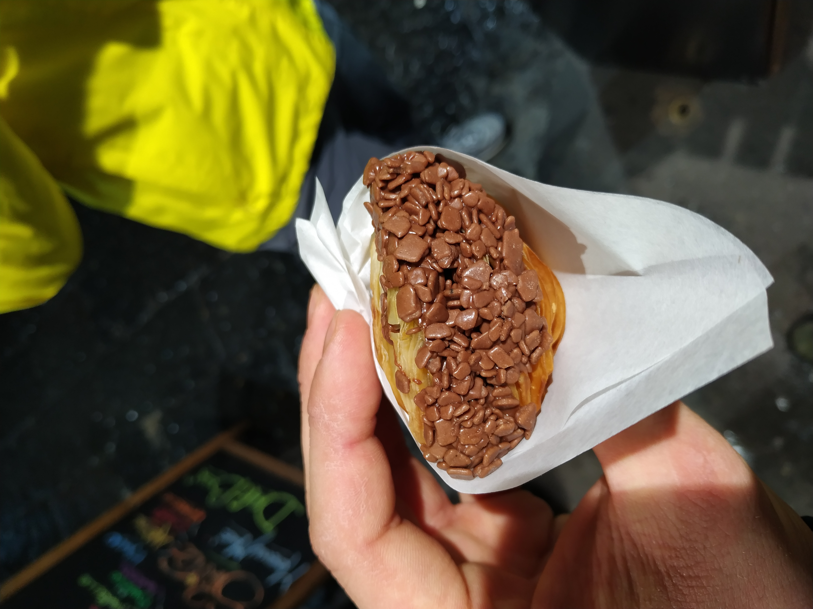

  Zapraszamy na ostatnią część relacji z Neapolu. Tym razem o naszym dniu leniucha, a także o tym, że na samolot warto udać się spacerem. 😁

—-

  Kolejny dzień w Neapolu był zarazem ostatnim pełnym podczas naszej podróży. Przeznaczyliśmy go na spacery, gotowanie, odpoczynek, generalnie wspólne spędzanie czasu. Pewnie niektórzy oburzą się, że jak to? Powiedzą, że jeszcze tyle zostało do zobaczenia.. To prawda, natomiast my, w czasie każdej podróży staramy się znaleźć jeden dzień, który przeznaczony jest na leniuchowanie, wspólne przyrządzanie lokalnych potraw i wielogodzinne rozmowy. Również aparaty i telefony próbujemy odłożyć na bok, stąd tylko kilka zdjęć.

  
  
  
  
  
  

  W zasadzie jedyne o czym warto wspomnieć z tego dnia to atmosfera panująca w mieście przy okazji meczu Napoli – Juventus. Neapol żyje i oddycha futbolem. W tym miejscu to religia i pasja. Barwy, murale, figurki piłkarzy – wszędzie widać klubowe pamiątki i kolory Napoli. Co ciekawe, będąc w Neapolu nie trzeba nawet oglądać spotkania, aby wiedzieć, że padł gol. Kiedy nasz Piotr Zieliński zdobył bramkę na 1:0, można powiedzieć, że miasto wybuchło. Ludzie wybiegli na ulice, zaczęli krzyczeć i śpiewać. Natomiast po ostatnim gwizdku sędziego przez kilka godzin strzelano fajerwerkami, a kibice wznosili klubowe przyśpiewki. Neapol szybko nie poszedł spać…

–

  Ostatniego dnia udaliśmy się na lotnisko. Nie korzystaliśmy tym razem z żadnej komunikacji miejskiej, a zrobiliśmy sobie kilkukilometrowy spacer. Droga na port lotniczy wiedzie przez miasto. Można poznać kolejne ciekawe zakątki i podziwiać panoramę Neapolu z nieco innej strony. Jest to też okazja do zobaczenia kilku dzielnic, w których jest bardziej europejsko. Przede wszystkim panuje porządek, jest czysto, a na ulicach próżni szukać imigrantów.. 

  
  
  
  

  PS. Oczywiście leniwy dzień w Neapolu przeznaczyliśmy też na próbowanie lokalnych słodkości! Ale o tym w odrębnym poście. 😋😍😍

