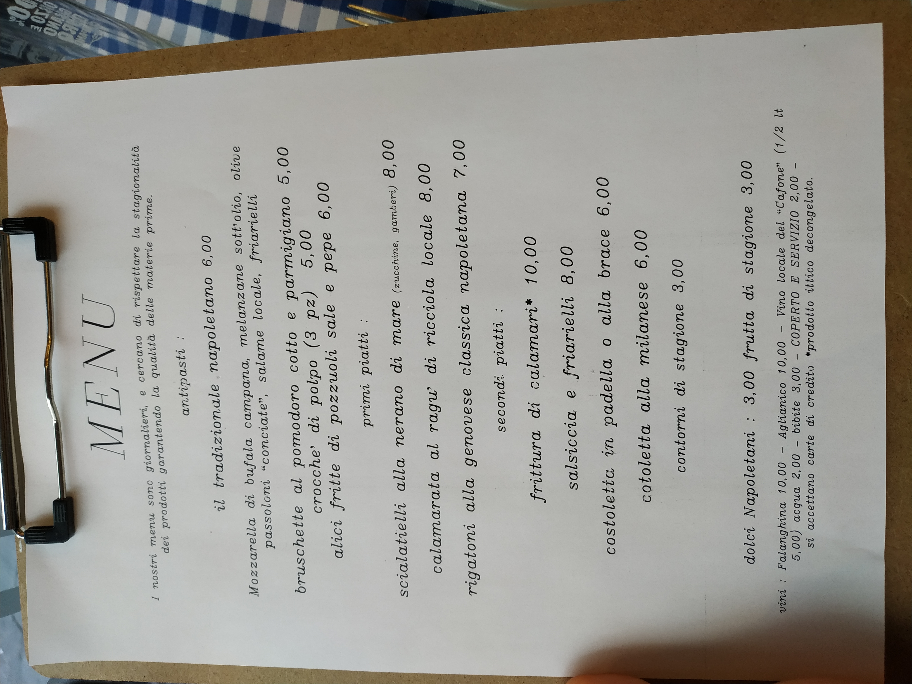
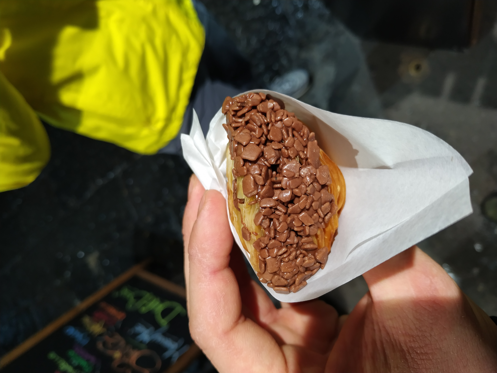

<h2>Salerno</h2>

<h3>Gdzie zjeść?</h3>

<h4 class='subtitle'>Kuchnia włoska, dania obiadowe, pizaa:</h4>

<h2>1. Luna Rossa (Via Roma 154)</h2>

  Niepozorna, nierzucająca się w oczy pizzeria. Doskonała w smaku pizza. Radzimy jednak wziąć jedzonko na wynos i udać się na pobliski, nadmorski deptak i usiąść sobie tuż nad wodą. Obsługa w lokalu pozostawia nieco do życzenia. Tylko jedna Pani mówi trochę po angielsku. Ceny niższe od standardowych (najtańsza pizza 3 euro). 🍕

  Polecamy każdy rodzaj tego włoskiego przysmaku - zwłaszcza naszą ukochaną Diavolę oraz Di bufalę. Smakowały wybornie! 😍😍

  
  
  

<h2>2. La Botte Pazza (Via Giovanni Ruggi D'Aragona 1)</h2>

  Fantastyczna, mała restauracyjka z daniami kuchni lokalnej. Bardzo popularna pośród mieszkańców Salerno. Co ciekawe, w tej knajpce dostaniecie darmowe wino! 🍷🍷

<h3>Gdzie spać?</h3>

<h2>1. Hydra House (Via Salvatore de Renzi 24)</h2>

  Apartament położony w górnej części miasta, co sprawia, że z tarasu rozpościera się cudowny widok. Mieszkanie składa się z dobrze wyposażonej kuchni z salonem, łazienki, sypialni z wygodnym łóżkiem oraz dużego balkonu.

  Kontakt z właścicielką jest bardzo dobry. Mówi ona płynnie i wyraźnie po angielsku. Opowiedziała nam nieco o mieście, restauracjach, które warto odwiedzić itp. Cena to około 45 euro za dobe/2 osoby.

  

<h2>Neapol</h2>

<h3>Gdzie zjeść?</h3>

<h4 class='subtitle'>Kuchnia włoska, dania obiadowe, pizaa:</h4>

<h2>1. Hostaria la Campanella (Via Lanzieri 39)</h2>

  Przyjemna, przytulna restauracyjka. Codziennie inne menu z daniami kuchni lokalnej. Obsługa bardzo miła, dzięki czemu czuliśmy się jak w domu. Ceny raczej niskie/standardowe (3-10 euro). 

  My jedliśmy makaron rigatoni alla genovese – przepyszny!

  
  
  

<h2>2. Pizza a Portafoglio (Via Toledo 244)</h2>

  Pizza i przekąski na wynos. Miejscówka położona przy Via Toledo, a więc jednej z najpopularniejszych ulic w Neapolu. Jedzenie smaczne i świeże. Ceny niskie/standardowe (od 1 euro).

  Polecamy frittatina di pasta - makaron wymieszany z beszamelem, serem, boczkiem, groszkiem, panierowany i smażony.

  

<h2>3. Pastars Napoli (Via Benedetto Croce 48)</h2>

  Makarony w najlepszym wydaniu. Duży wybór, niezłe ceny (ok. 5-7 euro). Miejsce, do którego naprawdę warto zajrzeć. Wszystko robione na świeżo i na naszych oczach. 🍝

  Polecamy wszystkie kombinacje makaronów i sosów. W zasadzie każdy ze spróbowanych smakował znakomicie.

  
  
  
  

<h2>4. Antica Pizzeria dell’Angelo (Piazzetta Nilo 16)</h2>

  Przepyszna neapolitańska pizza. Uprzejma obsługa, zamówienie zrealizowane bardzo szybko. Ceny bardzo dobre (4-9 euro), a do tego szeroki wybór. Każdy znajdzie pizzę dla siebie. 🍕
  
  Polecamy pizzę di bufala z dodatkiem rukoli. Coś pięknego 😊

  

<h4 class='subtitle'>Lody, kawa:</h4>

<h2>1. O Barett (Via Benedetto Croce 15)</h2>

  Urocza, przytulna kawiarnia z dużym wyborem smakołyków. Ceny świetne (od 0,5 euro). Każde ze spróbowanych ciasteczek było rozkoszne. 😊

  Polecamy Codina Nutella – małe, ale cudowne ciasteczko z czekoladą. 

  
  
  

<h3>Gdzie spać?</h3>

<h2>1. Ottieri Apartament Napoli (Via Annunziata 30)</h2>

  Miejsce, w którym zatrzymaliśmy się podczas naszego pobytu w Neapolu. Przytulne mieszkanie składające się z sypialni, kuchni  i łazienki. Bardzo schludnie i czysto, dodatkowo możliwość korzystania z ekspresu do kawy. Zaletą jest niewątpliwie cudowny widok z balkonu na dachy miasta. Kontakt z właścicielem był bardzo dobry. Mówił on biegle po angielsku, był niezwykle pomocny.

  Obiekt położony jest w pobliżu dzielnicy Forcella. Trzeba się więc nastawić na sporo śmieci i chaosu. Sam budynek jest jednak bardzo zadbany. Pamiętać trzeba, że koszt jednorazowego użycia windy to 10 centów!

  Cena dla 2 osób za dobę to ok. 180zł. W jej skład nie wchodzi śniadanie, w pokoju znaleźliśmy jednak sporo przekąsek typu ciastka, grzanki.

  

