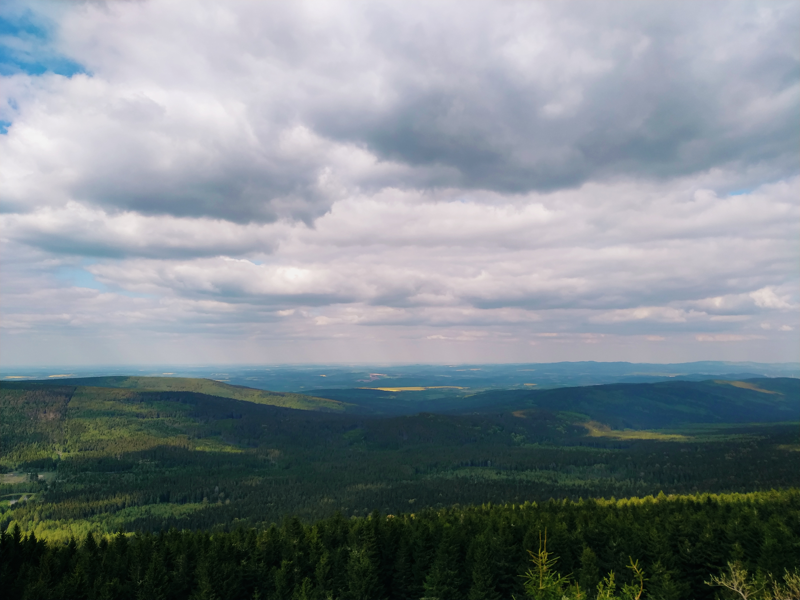

  W końcu nastał długo oczekiwany dzień jakiegokolwiek wyjazdu. Spośród kilku pomysłów na nasz cel wybraliśmy Karpacz na Dolnym Śląsku.

  W planie na piątek pierwotnie mieliśmy zdobycie Śnieżki. Zamysł ten jednak porzuciliśmy, gdyż okazało się, że tamtejsze szlaki są aktualnie pozamykane. Udaliśmy się więc w rejon parkingu przy Rozdrożu Izerskim (kawałek za “zakrętem śmierci” - jadąc od Szklarskiej Poręby), skąd ruszyliśmy na Wysoką Kopę, a wiec szczyt należący do Korony Gór Polski.  Oczywiście, gdy się zebraliśmy była już godzina 11 – ostrzegamy, nie jesteśmy zwolennikami zrywania się nad ranem żeby potem męczyć się w dzień. Kochamy zwiedzać, ale wypoczęci 😊. Tak, wiemy, przyjanuszowane.

  Mimo urokliwego stawu na starcie, początek trasy nie robi wielkiego wrażenia. Ot, prawie zwykła droga w lesie, którą można by bez problemów jechać samochodem.

  
  

  Prawdziwy urok przyroda zaczyna pokazywać kiedy mijamy Rozdroże pod Kopą (998 m.n.p.m.). Nieco bardziej dzika ścieżka, coraz piękniejsze krajobrazy. No i ławeczka z widokiem, na której można wypić herbatkę z termosu.

  
  
  
  
  

  Samo podejście pod szczyt jest fantastyczne! Drzewka, niczym nie zmącone poszycie i dużo błota. Góry w całej okazałości 😊.

  
  

  Schodząc w dół (drugą stroną) otoczenie nie przestaje zaskakiwać. Można się naprawdę zrelaksować. Po drodze mijamy uroczy potoczek i zmierzamy w kierunku kopalni kwarcu „Stanisław”. Gdy do niej docieramy, zastajemy trochę rozkopanych górek, pozostałości po budynkach i sporo śmieci. Trzeba jednak powiedzieć, że widoki bardzo ładne.

  
  
  
  
  

  Odchodząc od kopalni w stronę parkingu idziemy przyjemną ścieżką, a zza drzew co chwila wyłaniają się sporej wielkości skały. Ostatnia część zejścia jest dosyć stroma, ale liczne, wystające korzenie tworzą nam swoiste schody.

  

  Cała wycieczka zajęła nam prawie 6 godzin. Było warto! Szlak na Wysoką Kopę jest idealny żeby delikatnie zmęczyć nogi i napawać się przyrodą. Polecamy wybrać się z najbliższymi – łatwa, przyjemna trasa sprzyja rozmowom i pozwala nacieszyć się tymi, których kochamy 😊.

  Na koniec dnia oczywiście pizza i piwo. No cóż,  chyba się należało!

  
  
  

