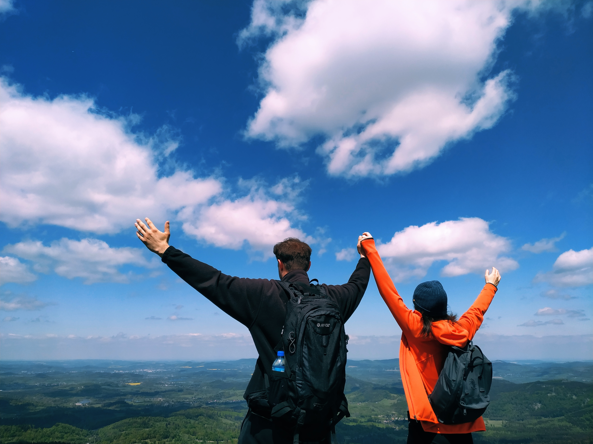
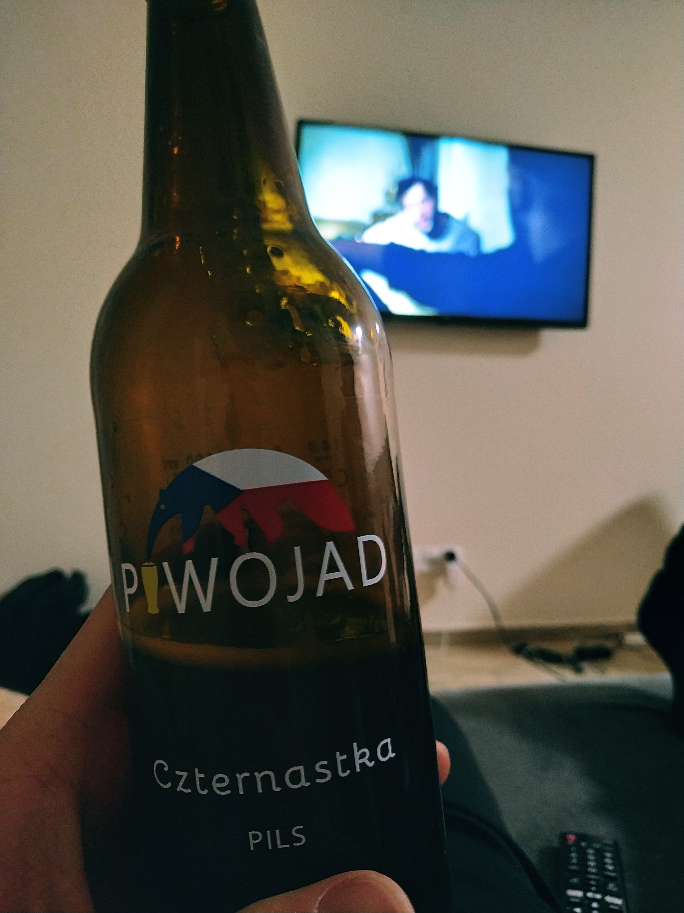

  Drugiego dnia Karpacz przywitał nas równie słoneczną pogodą. Po śniadaniu przygotowanym przez męską część ekipy ruszyliśmy w stronę wsi Czarnów, skąd startuje szlak na górę Skalnik. Szczyt ten zalicza się do Korony Gór Polski, nie wybraliśmy więc go przypadkowo.

  Widoki już na samym początku są naprawdę przyjemne. Dużo zieleni, drzew, a mało zabudowań. Podejście jest delikatnie strome, ale w zasadzie każdy powinien sobie z nim bez problemu poradzić. Wystające korzenie drzew tylko nam pomagają.

  
  
  <!--  -->
  

----

😂😂😂

  

  Dosłownie kilka minut przed szczytem znajdujemy urocze skały, na których postawiony został punkt widokowy (Mała Ostra). Krajobraz jest rzeczywiście dorodny. Oczywiście spędzamy tam wieki, najpierw napawając się tym co widzimy, a później robiąc zdjęcia.

  
  <!--  -->
  

  Z Małej Ostrej na Skalnik mamy rzut beretem. Sam szczyt pokryty jest wysokimi drzewami, więc nie ma tam zbytnio co podziwiać. Ruszamy więc w dół, gdyż w naszych planach na ten dzień jest jeszcze trochę atrakcji..

  
  

  Podsumowując temat Skalnika – kolejny przyjemny szlak, idealny żeby trochę się zmęczyć, ale nie za bardzo 😊. Po drodze i z Małej Ostrej kapitalne widoki, ze szczytu nie widać za to nic. Generalnie jednak warto się tam wybrać będąc w tych rejonach. Wyboru nie żałujemy!

  —

  Następny nasz przystanek to pobliskie Kolorowe Jeziorka w Rudawach Janowickich. Opinie, które czytaliśmy na ich temat były dość podzielone. Wielu narzekało na tłumy ludzi czy na to, że to co najwyżej kolorowe kałuże. Mieliśmy jednak nadzieję, że nie na darmo miejsce to swego czasu okrzyknięte zostało jednym z 7 cudów Polski w plebiscycie “National Geographic Traveler”.

  Kiedy zbliżamy się do parkingów naszym oczom rzeczywiście ukazują się setki ludzi. Naprawdę tłumy. Czemu się jednak dziwić, skoro jest poobiednia, sobotnia pora. Ruszamy jednak przed siebie i wykonując slalom między spacerowiczami oglądamy i podziwiamy okolice. Największe wrażenie robi na nas Jeziorko Purpurowe, chociaż to Błękitne tez jest niczego sobie. Niestety Żółte i Zielone były niemal całkowicie wyschnięte.

  
  
  
  
  
  

  No więc jak to jest z tymi Kolorowymi Jeziorkami? Jako miejsce samo w sobie nam podobały się bardzo. Jest to na pewno coś wyjątkowego, co widuje się rzadko. Z drugiej jednak strony odbiór nasz był trochę zaburzony z uwagi na ilości turystów. A może nie o same tłumy chodzi. Bardziej o zachowanie ludzi: piwo w ręce, wszechobecny papierosowy dym, totalne nieliczenie się z tym, że ktoś idzie obok, prawdziwie „biwaki” porozkładane tuż przy brzegu jeziorek.. Dlatego przyjechać tutaj polecamy każdemu, lecz zdecydowanie w środku tygodnia 😊.

  —

  Ostatni akord tego dnia, to „wspinaczka” na Skopiec. Najwyższy szczyt Gór Kaczawskich, zaliczany oczywiście do Korony Gór Polski.

  Samochód parkujemy na samym końcu wsi Komarno. Jak się okazuje na szczyt dochodzimy w niemal 20 minut.. W zasadzie relaksujący, popołudniowy spacerek. Warto jednak tam zajrzeć, choćby po to, aby przycupnąć na pniu, z którego rozpościera się świetny widok, a który znajduje się ledwie kilkadziesiąt metrów od Skopca 📷.

  
  
  

  Wieczór poświęcamy na katowanie serialu „Kalifat” na Netflixie i oczywiście delektowanie się Piwojadem 😋. Swoją drogą „Kalifat”, to kawał kapitalnego kina i bardzo nas wciągnął. Dwa wieczory w Karpaczu na niego wystarczyły…✔

  

