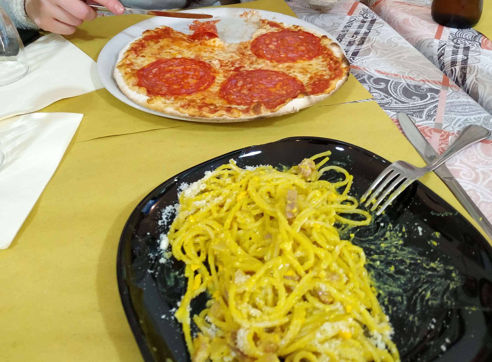

  W naszym cyklu „Witamy Porady” będziemy przedstawiać wam miejsca, w których można świetnie zjeść, przespać się, czy też wypić kawę lub drinka. W zestawieniach znajdą się zarówno restauracje, jak i kawiarnie czy drink bary. Dodatkowo, w postach z tej serii zagoszczą nasze opinie na temat miejsc noclegowych, z których mieliśmy okazję skorzystać.

<h3>Gdzie zjeść?</h3>

<h4 class='subtitle'>Kuchnia włoska, dania obiadowe:</h4>

<h2>1. Trattoria Pizzeria Da Simonetta (Via Pontremoli 30)</h2>

  Przytulna, lokalna Trattoria. Klienci to głównie miejscowi. W karcie oczywiście przystawki, pizza, makarony. Ceny jak na Rzym standardowe (7-11 euro za danie).

  Polecamy pyszną mozzarellę di bufala na przystawkę, natomiast jeśli idzie o dania główne to naszym faworytem jest spaghetti carbonara – jedna z najlepszych jakie jedliśmy w życiu.

  

<h2>2. Trattoria Pizzeria da Mario (Viale Carlo Felice 59)</h2>

  Wspaniała, rodzinna restauracja, w której panuje bardzo swobodna atmosfera. Miejsce to wyróżniają niespotykanie niskie ceny (4-8 euro za danie) i pyszne jedzenie.

  Polecamy pizzę Diavolę oraz spaghetti carbonara – nieco inny sposób przyrządzenia niż w Tratorii Da Simonetta, jednak równie fantastyczny smak.

  

<h2>3. La Taverna Italiana (Viale Manzoni 107)</h2>

  Bardzo dobry wybór na posiłek w pobliżu dworca Roma Termini. Przyzwoite ceny, bardzo smaczne makarony oraz pizza. Dodatkowo przemiła obsługa, która sprawia, że można poczuć się swobodnie.  
  Polecamy Lasagne – palce lizać!

  
  

<h2>4. Pizza Florida (Via Florida 25)</h2>

  Niepozorny, mały lokal ze wspaniała pizzą na kawałki położony na trasie między Placem Weneckim, a Panteonem. Duży wybór, niskie ceny.

  
  

<h4 class='subtitle'>Lody, kawa:</h4>

<h2>1. Le Foodie Cafe (Piazzale Appio 9)</h2>

  W dzień znajdziemy tutaj spory wybór słodkości. Wieczorem można za to wypić dobrego drinka w międzynarodowym towarzystwie. Miejscówka położona w pobliżu Arcybazyliki Św. Jana na Lateranie.

  

<h2>2. La Bottega Del Gelato (Via dei Pastini)</h2>

  Bardzo smaczne lody w pobliżu Panteonu. Duży wybór, ceny standardowe (4 euro za gałkę – wielkość jak na zdjęciu).

  
  

<h2>3. Bibliobar (Lungotevere Castello)</h2>

  Ciekawe miejsce na wypicie kawy i odpoczynek podczas zwiedzania, położone tuż obok Zamku Św. Anioła, po drodze do Watykanu. Ceny bardzo przystępne, kawa smaczna, a atmosfera przyjazna. Można się zrelaksować.

  

<h3>Gdzie spać?</h3>

<h2>1. SottosopraSannio (Via Sannio 48)</h2>

  Miejsce, w którym zatrzymaliśmy się podczas naszego pobytu w Rzymie. Ten sympatyczny hotelik, prowadzony przez Piero oraz Paole, położony jest w pobliżu stacji metra San Giovanni, niedaleko Arcybazyliki Św. Jana na Lateranie.

  Nasz pokój był całkiem duży, dysponowaliśmy również prywatną łazienką. Na wyposażeniu był TV, klimatyzacja, suszarka do włosów, ręczniki.

  Kontakt z właścicielami był znakomity. Przed przyjazdem, z Piero rozmawialiśmy na WhatsApp, natomiast na miejscu obsługiwała nas Paola. Oboje mówią płynnie i wyraźnie po angielsku.

Cena dla 2 osób za dobę ze śniadaniem to ok. 180zł.

  
  

