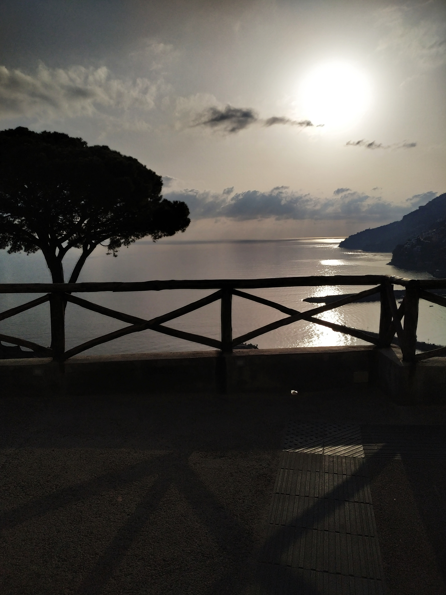

  Jak to mówią, marzenia są po to, aby je spełniać. Tak więc tego dnia spełniliśmy jedno z naszych. 😊😊

  W Salerno ranek powitał nas pięknym słońcem i wysoką jak na tę porę roku temperaturą. Zjedliśmy kilka crostini, wypiliśmy kawę i ruszyliśmy w stronę dworca głównego, skąd odjeżdżają autobusy Sita Sud (bilet całodniowy to koszt 10euro/osoba. Autobus kursuje wzdłuż wybrzeża, można sprawnie dojechać do niemal każdego miasteczka). W naszym planie było Amalfi, a następnie zamierzaliśmy udać się do Positano. Ekscytacja była duża, gdyż o tym kierunku myśleliśmy od bardzo dawna.

  
  

  Czekając we Włoszech na autobus trzeba być gotowym na to, że przyjedzie o godzinie, o której akurat mu się zachce. Rozkłady jazdy równie dobrze mogłyby zniknąć, trzeba więc uzbroić się w cierpliwość.

  W końcu ujrzeliśmy niebieski autobus i ruszyliśmy do Amalfi. Mimo, że odległość nie jest daleka, to podróż trwała ponad godzinę. Wszystko z powodu niesamowicie krętej i wąskiej drogi. Jedzie się bardzo wolno, tuż nad przepaścią. Trzeba jednak przyznać, że kierowcy spisują się tutaj znakomicie i czuliśmy się bardzo bezpiecznie. Widoki zza szyby były cudowne. Co ciekawe, kierowca w zasadzie co chwilę używał klaksonu, aby ostrzec wyjeżdżające zza zakrętów samochody. Byliśmy nawet świadkami stłuczki, jak na polskie warunki całkiem niemałej, ale właściciele tylko spojrzeli na potłuczenia, machnęli rękami i pojechali dalej. Widocznie dla okolicznych mieszkańców takie sytuacje to normalka.

  PS. Jedynym minusem jazdy autobusem tą drogą są ludzie z chorobą lokomocyjną. W tym miejscu pozdrawiamy sympatyczną Chinkę, która biedna całą drogę spędziła z głową w reklamówce :( 🤮😷 

  Gdy dojechaliśmy do Amalfi byliśmy zachwyceni. Miasteczko robi wielkie wrażenie. Klimat jest niepowtarzalny. Mimo mało turystycznego terminu ludzi było dość sporo. Widać, że w Amalfi istnieje normalne życie (co innego w Positano, ale o tym później). W chwili obecnej zamieszkuje tutaj około 5000 osób, a w 1997 roku miejsce to wpisane zostało na listę Światowego Dziedzictwa UNESCO. Warto też dodać, że miasteczko słynie z papieru. Znajduje się tutaj Muzeum Papieru, gdyż region ten był jednym z pierwszych w Europie, w którym rozpoczęto jego produkcję. Charakterystyczne dla Amalfi są również liczne stoiska z włoskim limoncello, a więc likierem cytrynowym uwielbianym w tym regionie.

  

  
  
Już od pierwszego spojrzenia na zabudowania, to jedno szczególnie rzuciło nam się w oczy.

  
  

  Jak się okazało jest to cmentarz, do którego prowadzi tunel wydrążony w skałach. Zdecydowanie jest to najpiękniej położony grobowiec, jaki kiedykolwiek widzieliśmy...

  
  
  
  

A tutaj kilka zdjęć samego miasta:

  
  
  

  Z Amalfi wybraliśmy się do Positano. W tym okresie miejsce to jest niemal wyludnione. Hotele i restauracje są pozamykane, czynne są jedynie nieliczne sklepiki, a w wąskich uliczkach robotnicy przygotowują deptaki na sezon turystyczny. Brak ludzi ma jednak sporo zalet. Przede wszystkim wolną od setek leżaków plażę. Prawie cała dla nas. Usiedliśmy więc na skale, otworzyliśmy po małym włoskim piwku i po prostu cieszyliśmy oczy. Z resztą, tutaj nie ma co pisać. Sami popatrzcie:

  
  
  
  
  

Śmiało możemy powiedzieć, że Wybrzeże Amalfitańśkie nas zachwyciło. Na pewno tam wrócimy, ale tym razem na dłużej…💖💖
